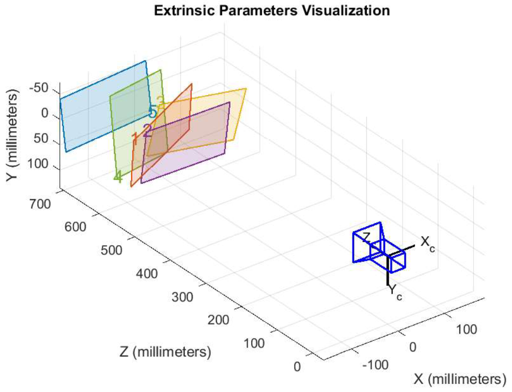
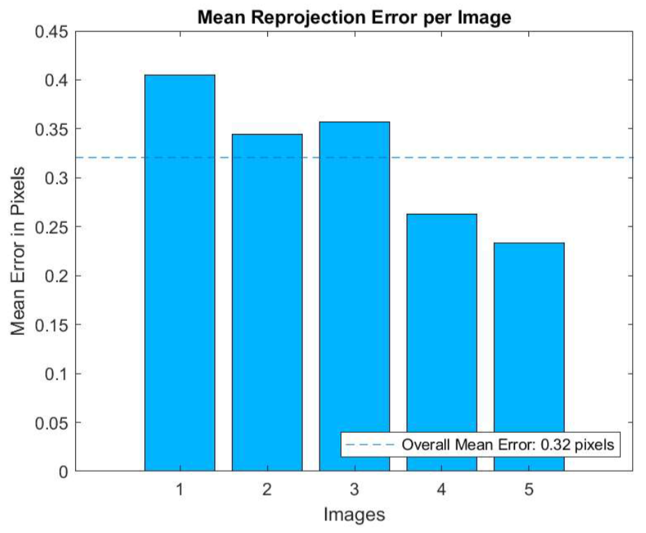

# Camera Calibration using MATLAB
A quickstart guide for the camera calibration-workflow can be found under this link:\
https://www.youtube.com/watch?v=x6YIwoQBBxA

For Monocular Cameras use:\
https://de.mathworks.com/help/vision/ug/using-the-single-camera-calibrator-app.html

For Stereo Camera use:\
https://de.mathworks.com/help/vision/ug/using-the-stereo-camera-calibrator-app.html

Either use the MATLAB Camera Calibrator App from the Image Processing and Computer Vision Module directly or 
simply run the provided camera specific script in MATLAB to obtain its intrinsic parameters. Note, that you 
have to set the base path to your directory in the respective script, according to your system!
 
As an example, the visualizations of the Logitech-C270-HD-Webcam [calibration script](calibrationParameters.m) 
are shown below. Given the camera specific calibration images of the checkerboard pattern, your extrinsics 
should look something like this:

... and your mean reprojection error like this:

Also note, that the numeric values of the camera intrinsics are printed to the MATLAB command window and stored
in the Workspace, from where they can be directly used or exported to another project. 